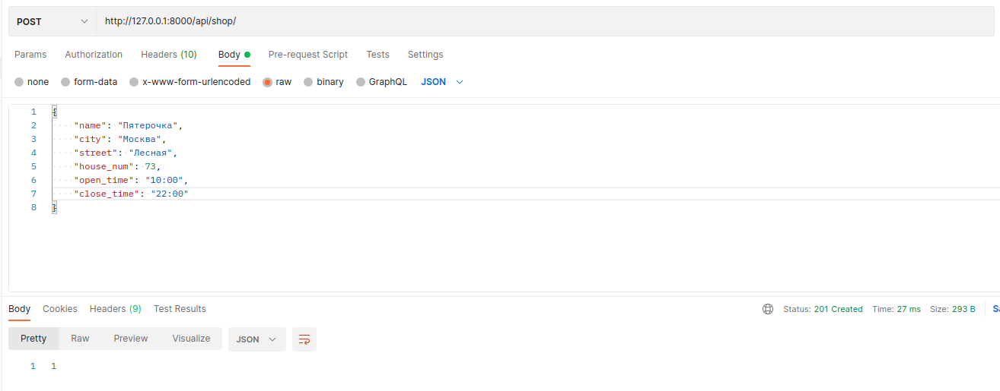

## Deploy

1. Склонируйте репозиторий `https://github.com/quantum73/shops.git`
2. Перейдите в корень папки с репозиторием
3. Выполните команду `docker-compose up -d`
4. Подождите пока сформируются образы и контейнеры.<br> 
По окончании должно быть примерно следующее сообщение в консоли:<br>
```shell
...
Creating shops_db_1 ... done
Creating shops_web_1 ... done
```
5. Теперь можно отправлять запросы на API.<br> 
Корневой `url` имеет вид `http://0.0.0.0:8000/api/` (или `http://127.0.0.1:8000/api/`), 
остальные роуты реализованы согласно ТЗ.

### Пример запроса `POST /shop/` через Postman:
